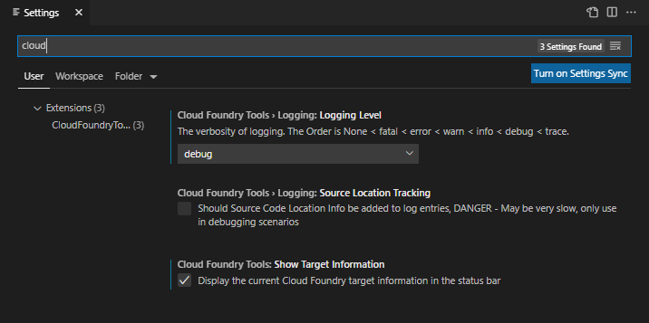

# cloud-foundry-tools

This VSCode extension provides tools for easy application development with Cloud Foundry. Its' tools contains such functionality as "Login to Cloud Foundry", "Create service", "Bind service", "Unbind service", etc.

## Table of contents

- [Features](#features)
- [Dependencies](#dependencies)
- [How to Run Locally](#how-to-run-locally)
- [How to set up logger preferences](#how-to-set-up-logger-preferences)
- [Known Issues](#known-issues)

---

## Features

- a new View-Container of vscode, with a new View is added titled "Cloud Foundry".

[back to top](#table-of-contents)

---

## Dependencies

- cf-cli tool [v7.2.0](https://github.com/cloudfoundry/cli/releases/tag/v7.2.0)
- cf-cli `targets` [see here](https://github.com/guidowb/cf-targets-plugin)
- cf-cli called `cf-service-info` (go plugin for cf-cli tool that provides resource binding functionality)

[back to top](#table-of-contents)

---

### How to run locally

- clone the repo
- open it in a vscode
- execute `yarn` and `ci:artifacts_only`
- run the launch config 'Run extension'
- see available commands via `Command palette` (with prefix `CF`)

[back to top](#table-of-contents)

---

### How to set up logger preferences

[back to top](#table-of-contents)

---

## Known Issues

- Mostly needs handling failure situation and nice cancelation option for long running steps.

[back to top](#table-of-contents)

---

## Contributing

Contributing information can be found in the [CONTRIBUTING.md](CONTRIBUTING.md) file.

[back to top](#table-of-contents)
